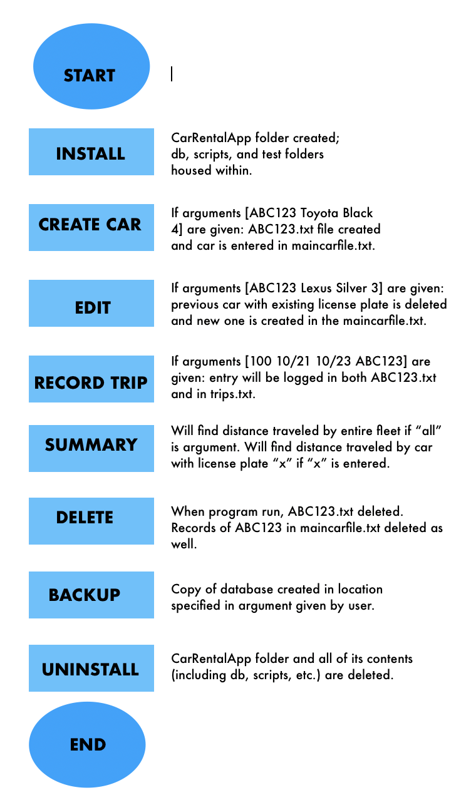
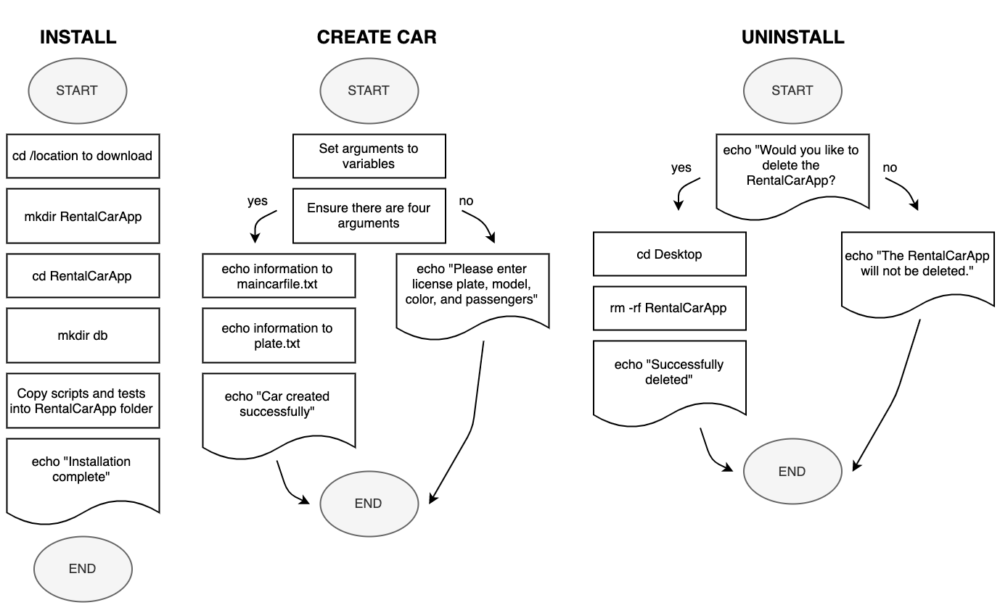

Car Rental Minimal App
===========================

A minimal car rental management app, coded in Bash.

Contents
-----
  1. [Planning](#planning)
  1. [Design](#design)
  1. [Development](#development)
  1. [Evalution](#evaluation)
  1. [Citations](#citations)

Planning
----------
**Defining the Problem (Topic 1.1.1):**
The client for this problem is the owner of a small car rental agency called Minimal Car Rental. This business employs multiple people with little technological experience and this project aims to help the client have a comprehensive system to keep track of the business's logs. 

Currently, the business owner is using a physical system with pen and paper. While this is functional, it is more time consuming and also can be disabling in the long term. It decreases productivity and makes it difficult to manage statistics and further growth of the business. 

I propose a new computer based system which would have a variety of functions as listed in the Success Criteria. This system hopes to be as simple to use as possible so the employees will easily be able to use the system. In addition, the system will be easy to transition to and will minimize the amount of work that the business has to do to keep records. 

I will create a Bash program to manage all of this and help the business. 

**Proposed Solution:**
I decided to use Bash to solve this problem because of the level of simplicity it brings. Since the client requires an extremely simple system which is easy to train multiple employees on how to use, the entire program harnesses simple functions and applications built into the computer. 

There are only a few functions; however, this makes it easy to understand and Bash also makes us capable of expanding the program to encompass more aspects of the business if necessary. For this specific client, an online system isn’t necessary since all of the data can be stored locally at the store. Thus, it wouldn’t make sense to develop that function. Further, a Bash program requires no additional software (unless using Windows, in which case, a Linux simulator is required) which again, ensures that the program is very user friendly and simple to use. 

Additionally, I used GitHub to store this application because of its ease of use. GitHub's connectivity enables me to share this application with my classmates and teachers easily; it also allows sharing with other potential users. Moreover, GitHub's ability to make a well-formatted README section makes sure that no matter who observes my software, they'll be able to view my documentation and understand how it works and why it was created that way. 

**Success Criteria:**
1. A car can be created and stored in the database
2. A car's information can be edited
3. A car can be deleted from the database
4. The installation is ***simple, meaning it's a one-step process***
5. A summary (total/average distance traveled) can be generated for a particular car
6. Trips can be recorded and stored for an existing car.
7. A basic database system is implemented.
8. A basic backup function is available. 

Design
---------
### First Sketch of the System:

**Fig. 1** First sketch of the system showing the main input/output and host computer with details such as possible actions and file organization. 

### Testing Plan: 



**Fig. 2** Diagram of how testing will be performed to ensure success criteria as listed above were met. 

### Steps for Development/Pseudocode


**Fig 3** Flow diagrams of how the install, create car, and uninstall functionalities will work. 

Development
--------
### 1. Script to install the app
Steps:
1. Change directory to desktop
2. Make RentalCarApp folder and create db folder within. 
3. Copy scripts and tests folder from existing application into new RentalCarApp folder.

The following script creates the RentalCarApp fodler and all of its contents.
```.sh
#!/bin/bash

#This file creates the folder structure for the Minimal Car Rental app.

echo "Starting the installation:"
echo "Downloading on desktop..."

#Moving to the desired location.
cd /Users/rikiodahlgren/Desktop

#Create App folder.
mkdir RentalCarApp

#Moving inside the RentalCarApp folder.
cd RentalCarApp

#Creating database folder
mkdir db

#Copying in tests and scripts
cd ../SchoolWork/ISAK/G11/ComSci/process-journal-rikiod/Topic1/MinimalCarRental/RentalCarApp/
cp -r scripts /Users/rikiodahlgren/Desktop/RentalCarApp
cp -r tests /Users/rikiodahlgren/Desktop/RentalCarApp

echo "Installation complete."
exit
```

### 2. Creating a new car
Steps:
1. Get inputs (either by read or with arguments)
2. Check if the number of arguments is 4, otherwise exit. if $# -eq 4; then continue, else exit
3. Write to main file with an extra line. echo "    " >> maincarfile.txt
4. Create car trip file with licenseplate.txt. echo "    " >> plate.txt

Inputs: plate number, model, color, number of passengers --> output: logged in file 

The following script inputs the data for a new car into a file called maincarefile.txt and records the license plate number in  a file called plate.txt. 

In the beginning, this program posed some difficulties in finding how to send information to a specific file. However, I found that the ">>" function can do that quite easily. 
``` .sh 
#!/bin/bash

#This program enables users of the Minimal Car Rental software to create a car in the system.
#The car will be logged in maincarfile.txt. 

echo $*

#Ensuring four arguments were entered
if [[ ($# -ne 4) ]]; then
  echo "Incorrect input. Please enter license plate, model, color, and number of passengers."
  exit
fi

plate=$1
model=$2
color=$3
passengers=$4

#Putting car's info on maincarfile.txt
echo "$plate $model $color $passengers" >> ~/Desktop/RentalCarApp/db/maincarfile.txt
echo "" > ~/Desktop/RentalCarApp/db/$plate.txt
echo "Car created successfully."
```

### 3. Recording a new trip 
Steps:
1. Get inputs (either by read or with arguments)
2. Check if the number of arguments is 4, otherwise exit. 
3. Ensure the car license plate is already logged in maincarfile.txt, otherwise exit. 

Inputs: distance, start date, end date, license plate --> output: logged in life

``` .sh
#!/bin/bash

#This program enables users of the Minimal Car Rental application to record a trip with a car. 
#The trip will be logged in the car's plate.txt file.

echo $*

plate=$1
distance=$2
dateOut=$3
dateIn=$4

cd ~/Desktop/RentalCarApp/db/

#Ensuring file exists and four arguments were entered
if [[ ($# -ne 4) ]]; then
  echo "Please enter license plate number, distance (km), date out, and date in."
  cd ../db

elif [ ! -f "$1.txt" ]; then
  echo "Car doesn't exist, please try again."

#Creating plate.txt file with car's data.
else
  echo "$distance $dateOut $dateIn" >> $plate.txt
  cd ../scripts
  echo "Trip successfully recorded."
fi
```

### 4. Edit a car 
Steps: 
1. Find out which car needs to be edited from user's arguments
2. Delete existing car
3. Create new replacement car

Input: license plate, car model, car color, occupancy --> edited car

This program takes the data that the user wants to edit as arguments and replaces the previous data about the car with it. It functions very similarly to the delete function (see #5) by deleting the line within the maincarfile.txt. Then, after that, it essentially does the same as creating a car (see #2). 

```.sh
#!/bin/bash
#This program edit the information of an exiting car in maincarfile.txt
#User enters [license place] [model] [color] [passengers]

if [ $# -ne 4 ]; then
  echo "Error with the number of arguments"
  echo "Enter License Model Color Passengers"
  exit
fi

license=$1
maker=$2
model=$3
pp=$4

cd ../db

if [ ! -f "$license.txt" ]; then
  echo "File not found!"
fi

#find the line with the given car plate and delete it
sed -i '' "/^$license/d" maincarfile.txt
#add the new information
echo "$license $maker $model $pp" >> maincarfile.txt
cd ../scripts
bash frame "Car edited successfully"
```

### 5. Delete a car
Steps:
1. Find out which car needs to be deleted from user
2. Move to database and delete license plate line from maincarfile.txt
3. Delete individual plate file

Input: license plate --> output: maincarfile.txt deleted and licenseplate.txt deleted; communicated to user 

This program works by utilizing the sed command. The program takes the argument provided by the user and is used in the line that says `sed -i ' ' "/$1/d" db/maincarfile.txt`. $1 is the argument so in this way, the program takes the license plate provided and deletes it from maincarfile.txt.

Additionally, the individual license plate file is deleted by simply removing the file with the command `rm`. 

It was difficult to figure out how to delete a specific car in the beginning until I found the "sed" functionality which is typically used for replacement for deletion.
```.sh 
#!/bin/bash

if [ $# -eq 1 ]; then
       	#Deleting line from maincarfile
	cd ..
        sed -i '' "/$1/d" db/maincarfile.txt

	#Deleting the plate file
        cd db
        rm  $1.txt
else
        echo "Invalid input: please enter the license plate number as an argument."
fi
```

### 6. Summarize the fleet and/or an individual car's distance
Steps:
1. Find out from user if program should summarize all cars or for an individual car
2. Loop through each line and add to find summary of all cars if "all" is entered as an argument
3. Loop through each line and add when license plate is detected if license plate is entered as an argument.

The following script finds the total distance traveled by all of the the cars in the car rental system if "all" is entered as an argument. If a license plate is entered as an arugment, then the program will find the total distance traveled by that particular car.

The summarize program was quite hard because specific lines had to be found within the maincarfile.txt; however, I was able to use while loops and have the program loop through each line reading word by word. For example, the use of `for f in .txt` effectively loops through all the text files in the folder. Then, the code `while read line; do for km in $line` reads all the words by utilizing the while loop to look through all of the file's lines and the for loop to look at every word in each individual line.

```.sh
#!/bin/bash

#This program will find the total distance traveled by all the cars if "all" is entered.
#This program will find the total distance traveled by a certain car specified by the user (enter the license plate).

cd../db

#Ensuring correct arguments were entered.
if [ $# -ne 1 ]; then
    echo "Enter license plate number or the word all."
    exit
fi

file=$1

#If "all" was entered as an argument, finding total distance traveled by all cars.
if [ $file == all ]; then
    total=0
    #Reading file; looking at each line 
    #Looping through all txt files
    for f in *.txt;
    do
        if  [[ ($f == "maincarfile.txt") ]]; then
            continue
        fi

        while read line;
        do
          #Going through each line word by word 
          for km in $line
          do
            (( total=$km+$total ))
            break
          done
        done < "$f"
    done

    cd ../scripts
    cd scripts
    echo "The total distance traveled by all the cars was $total km."
    exit

elif [ ! -f "$file.txt" ]; then
  echo "The car, $file, doesn't exist."
  exit
fi

#Calculating total distance car specified by user.
total=0

while read line;
do
  for km in $line
  do
    (( total=$km+$total ))
    #After first cycle, loop will break
    break
  done
done < "$file.txt"

cd ../scripts
echo "The car with license plate $file traveled $total km."
```
It should be noted that this summarize program doesn't find the average distance covered by a singular car. 

### 7. Backing up the database 
Steps:
1. Obtain inputs 
2. Check if the number of arguments (inputs, found with $#) is one, otherwise exit.
3. Copy database to the input using the function cp -a <File> <Destination>.
	
Inputs: name of location to backup (ex. hard drive name) 

The following script creates a backup of the database in a designated location which is given to the system by the user in the form of an argument. For example, /Volumes/HARDDRIVENAME.

``` .sh
#!/bin/bash

#This program will backup the entirity of the database folder within the MinimalCarRental application

location=$1
if [[ $# -ne 1 ]]; then
        echo "Sorry, there was an error."
        exit
else
        cp -a RentalCarApp/db $location
fi
```
It is also important to note that depending on where the RentalCarApp folder is stored, the command `cp -a RentalCarApp/db $location` may need to be edited in order to copy the correct folder (for example, if the folder is downloaded on the desktop, then the command may have to be `cp -a Desktop/RentalCarApp/db $location`). 

### 8. Uninstall the program
Steps:
1. Ensure user wants to delete program
2. Move to location of RentalCarApp
3. Remove folder and all of its contents

The following program uninstalls the RentalCarApp program in its entirety.
```.sh
#!/bin/bash

#This program deletes the RentalCarApp and all of it's data.

echo "This program deletes the RentalCarApp and all of it's data."
echo "Would you like to continue with deleting the program? Answer Y or N and press ENTER:"
read answer 

if [[ $answer == Y ]]; then
	echo "Moving forward with deleting the program..."
	cd /Users/rikiodahlgren/Desktop/
	rm -rf RentalCarApp
	echo "Successfully deleted."
	exit
else
	echo "The RentalCarApp will not be deleted."
	exit
fi
```
It is important to note that the section regarding the location of the RentalCarApp, `cd /Users/rikiodahlgren/Desktop/` must be edited depending on where the program is currently stored. If the install program is used to download the program, it should default to downloading on the desktop. However, the section about the user (rikiodahlgren) will most likely need to be edited. 

### 9. Man pages
Man pages, short for manual pages, are forms of software documentation. In this CarRentalApp program, man pages were created for six of the eight commands (install, createCar, recordTrip, editCar, deleteCar, and backup). These man pages contain information about usage by including a description, synopsis, examples, and possible contact methods if further questions persist. 

The man pages for this RentalCarApp can be found in this repository under the manPages folder. These man pages were classified with the suffix 6, used for games, because the RentalCarApp is similar to a game. While it could be used for an actual rental car agency, its current limited capabilities render it more of a project or game. Thus, the man pages were stored in man6. 

Lastly, the decision to use man pages themselves rather than other forms of documentation such as an online or paper manual was made because of the fact that it is essentially built in with the program and doesn't require internet connection. The convenience of being able to simply inquire about a command within the application itself is very important and renders man pages more convenient and accessible than other methods such as an online or paper manual. 

### 10. Testing
**Summary:** 
Tests were made (see tests folder within repository) to test the createCar and install function. Tests could be further created to test all other capabilities within the application such as recordTrip, backup, etc. Details about the functionality of the tests and their usage is recorded in the following subsections.

**Test 1:**
Testing the createCar.sh function. Was a file with extension txt (a log of the license plate) created and was a record for the car created within the mainfile?

The first run of the program had a few issues: firstly, the test file needed to move to the main folder by using the command `cd ../`. This is necessary because the `createCar.sh` function resides in the main folder whereas the test file is inside the test folder.

Additionally, the file couldn't detect if the file was actually formed or not properly. This was because when we formed the `cd ../` function earlier, then using `../db/TXM301.txt` was repetitive and rather than searching for the file within the database, it would go a level of organization further up and thus, exit the RentalCarApp folder. To solve this, we simply used the following function: `db/TXM301.txt`. 

To check if the car was added to the main file, we used the following script: `lastLine = $( tail -n 1 db/maincarfile.txt )`.
This effectively sets a variable called lastLine to the last line of the maincarfile.txt. This is because the function "tail" reads the file from the end to the beginning and the number "1" grabs only the very last line of the file. This variable "lastLine" is then later compared to the statistics of the car to ensure the createCar.sh function is working correctly. 

When creating this script, however, it did not originally work because when it compared the statistics of the car in the form "TXM301 Nissan Red 9" to the variable lastLine, the function `[ "TXM301 Nissan Red 9" == $lastLine ]; then` was used. The lack of quotation marks around the variable removes the spaces from the last line, thus making the two arguments not equal to each other and yielding a false result. So, when replaced with the function `[ "TXM301 Nissan Red 9" == "$lastLine" ]; then`, the test program worked successfully. 

For test 1, we effectively created a program which reliably ensures that the createCar.sh program works accurately. We performed dynamic testing, meaning that the program itself was run, whereas in static testing, the code itself is just looked through. Additionally, we performed alpha testing which means that we, the developers themselves, performed the test. If somebody not a member of our CS class instead had performed the testing, this would've been considered beta testing. Lastly, we performed white-box testing because when coding the program to test createCar.sh, we had access to the code of that program and we were able to use that to create a testing program which works correctly. 

This testing program accurately determines whether or not the createCar.sh program is functioning correctly and communicates it to the user well. This is crucial to ensuring that the final MinimalCarApp product works seamlessly and meets the client's needs. 

**Test 2:**
Testing the install.sh function. Was a directory titled RentalCarApp created on the desktop, was a directory called db formed within the RentalCarApp folder, and was a directory called scripts formed inside the RentalCarApp folder as well?

There were two issues when coding the program to test the install.sh function; however, they were both fairly minor and were easy to solve.

Firstly, the program changed directories to Users/rikiodahlgren/Desktop and then ran the program install.sh. However, the install.sh program wasn't housed on the Desktop. This did not result in any additional code having to be written or deleted, rather, the order of the actions had to be changed. When changed, the program ran the program first and then moved to the Desktop. 

Secondly, the code to see whether or not the folder existed posed a small issue. I originally wrote the code as `
if [ -f RentalCarApp ]; then` but I realized that the argument -f meant the program would search for a file called "RentalCarApp." I needed the program to instead search for a directory called "RentalCarApp" so I changed the argument to -d, thus yielding `if [ -d RentalCarApp ]; then`. Once changed, the program worked accurately.

For test 2, we effectively created a program which reliably ensures that the install.sh program works as intended. We performed dynamic, alpha, and white-box testing.

This testing program accurately determines whether or not the install.sh program is functioning correctly and communicates it to the user well. This is crucial to ensuring that the final MinimalCarApp product works to fulfill the client's needs.

**Test 3:**


Evaluation
-----------

### Success Criteria Fulfilment
The success criteria as detailed in the planning section of this document have all been met.

Using the createCar function, a car was be created and successfuly stored in the maincarfile.txt. A car's information can also be edited using the edit function. When the edit function is used along with the proper arguments inputted, then the license plate number, make, color, and passengers can all be edited. A car can also be deleted from the database using the delete function and then entering the license plate as an argument. This removes the car from the maincarfile.txt. The installation is also quite simple because it just requires one step: performing the actual command. The summary function also exists when summary.sh is used: writing <all> or <license plate> as an argument enables summaries to be generated for each the entire fleet or fot a particular car. It is important to note, however, that the average distance traveled can't be generated for a particular car. Trips can be recorded and stored for an existing car using the recordTrip function and all of this data is stored in a basic database system. Using the backup functionality, all of the data in the database can be backed up to other locations in a computer or in a hard drive specified by the user. 

The system diagram and all of the eight commands detailed in the development section further detail the way that the RentalCarApp is organized and created, thus showing how all of the success criteria were met. Further evidence to verify that these commands genuinely work in Bash can be found within this repository under the folders "scripts."

### Future Improvements
While this program is definitely functional and a great option for those looking for minimal car rental management systems, it also has a lot of aspects where it could grow and have more sophisticated features. 

The uninstall, delete, create car, and record trip functions are quite simple so don't necesarrily need to be improved, even if the car rental agency were to grow and wanted to employ more complex functionalities. However, the delete function could be improved to allow deletion of trips. Meanwhile, the create car function could be improved so that pricing was associated with each car and calculated as such when a trip was recorded. On top of that, if a clients' name was associated with recorded trips, then the accounting for the Minimal Car Rental would be a lot more simple. 

The install and backup functions are all fairly simplistic as well so while they could be improved, their functionality is already quite good. However, the install function could be made so that the location to install could be specified. In addition, backup could be simplified so that the suffix of "Volumes/" would not need to be written as an argument: instead, simply the name of the hard drive name would need to be entered. 

The summarize and edit functions posed the most difficulties to me and as such, they also have the most room for improvement. While the summarize function is able to get the total distance for an individual car and for the entire fleet, it would be better if it were able to summarize data relating to the days rented out. In this way, it could see which cars were most popular and also which cars may require service most often due to their use. For the edit program, it would be better if individual trips could be edited so that typos could be corrected more easily. On top of that, the entire way of editing could be more easy for the user if rather than having to enter all the aspects of a car (license plate, car, model, passengers), only the license plate would have to be entered since that number typically stays constant on all cars.

Citations
---------
While the majority of the functions within Bash needed for this project were taught in the G11 CS class at UWC ISAK Japan, some of the functionalities also posed difficulties and required further research. As such, many additional sources were used:  

G, Mike. “Loops for, While, and Until.” BASH Programming - Introduction HOW-TO: Loops for, While and Until, 2018, tldp.org/HOWTO/Bash-Prog-Intro-HOWTO-7.html.

“Man Page.” Wikipedia, Wikimedia Foundation, 22 Aug. 2019, en.wikipedia.org/wiki/Man_page.

Rajput, Akshay, and Mohak Agrawal. “Sed Command in Linux/Unix with Examples.” GeeksforGeeks, 27 May 2019, www.geeksforgeeks.org/sed-command-in-linux-unix-with-examples/.


