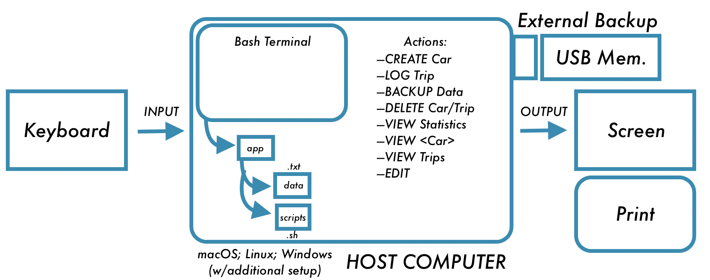

Car Rental Minimal App
===========================

A car rental management minimal app in Bash.

Contents
-----
  1. [Planning](#planning)
  1. [Design](#design)
  1. [Development](#development)
  1. [Evalution](#evaluation)

Planning
----------
**Defining the Problem (Topic 1.1.1):**
This problem aims to help a business owner have a comprehensive system to keep track of the tasks that a car rental service would have to perform. This includes creating new cars within the system, logging trips, and keeping statistics of the mileage of various cars. This system hopes to be as easy to use as possible so the transition is quick and easy; the system will heavily minimize the amount of work that the car rental business has to do. Since the business owner is not especially familiar with computer programs, the solution will also attempt to be very easy to install and then easy to perform actions within the program.

Design
---------
**First Sketch of the System:**

**Fig. 1** First sketch of the system showing the main input/output and host computer with details such as actions and organization.

Development
--------
### 1. Script to install the app
The following script creates the app folder and inside, it creates a folder for data and for scripts. 
```.sh
#!/bin/bash

#This file creates the folder structure for the Minimal Car Rental app.

echo "Starting the installation:"
echo "Type the path where you would like to install and press ENTER."
read path

#Moving to the desired location.
cd $path
#Create App folder.
mkdir RentalCarApp

#Moving inside the RentalCarApp folder.
cd RentalCarApp

#Creating Database folder and Scripts folder.
mkdir db
mkdir scripts

echo "Installation complete."
exit
```

### 2. Creating a new car
Inputs: plate number, model, color, number of passengers --> output: logged in file 

1. Get inputs (either by read or with arguments)
2. Check if the number of arguments is 4, otherwise exit. if $# -eq 4; then continue, else exit
3. Write to main file with an extra line. echo "    " >> maincarfile.txt
4. Create car trip file with licenseplate.txt. echo "    " >> plate.txt

The following script inputs the data for a new car into a file called maincarefile.txt and records the license plate number in  a file called plate.txt. 

``` .sh 
#!/bin/bash

#This program enables users of the Minimal Car Rental software to create a car in the system.
#The car will be logged in maincarfile.txt.

echo $*

plate=$1
model=$2
color=$3
passengers=$4

if [[ $# -ne 4 ]]; then
        echo "Sorry, there was an error. Next time, please enter the license plate number, the mode$
        exit
else
        echo "$plate $model $color $passengers" >> RentalCarApp/db/maincarfile.txt
        echo " " >> RentalCarApp/db/$plate.txt
        echo "The car with the license plate $plate has been added."
        echo "To add another car, run this same program with the arguments plate, model, color, and$
        exit
fi
```

### 3. Recording a new trip 
Inputs: distance, start date, end date, license plate --< output: logged in life
1. Get inputs (either by read or with arguments)
2. Check if the number of arguments is 4, otherwise exit. 
3. Ensure the car license plate is already logged in maincarfile.txt, otherwise exit. 
3. Write to trips.txt with an extra line. 

The following script records the trip of a car in a file called trips.txt. 
``` .sh
#!/bin/bash

#This program enables users of the Minimal Car Rental application to record a trip with a car.
#The trip will be logged in trips.txt

echo $*

distance=$1
startDate=$2
finishDate=$3
licensePlate=$4

if [[ $# -ne 4 ]]; then
        echo "Sorry, there was an error. Next time, please enter the distance (km), the start date,$
        exit
else
        if [[ -f $licensePlate.txt ]]; then #Checking if the car exists or not
                echo "$distance $startDate $finishData" >> RentalCarApp/db/trips.txt
                bash "The $distance km trip has been logged on the car with plate $licensePlate."
                echo "To add another car, run this program with the arguments distance, start date,$
                exit
        else
                echo "Sorry, that car hasn't been created yet."
                exit
        fi
fi
exit
```

### 4. Backing up the database 
Inputs: name of location to backup (ex. hard drive name) 
1. Obtain inputs 
2. Check if the number of arguments (inputs) is one, otherwise exit.
3. Copy database to the input. 

The following script creates a backup of the database in a designated location.
``` .sh
#!/bin/bash

#This program will backup the entirity of the database folder within the MinimalCarRental applicati$

location=$1
if [[ $# -ne 1 ]]; then
        echo "Sorry, there was an error."
        exit
else
        cp -a RentalCarApp/db $location
fi
```

Evaluation
-----------


